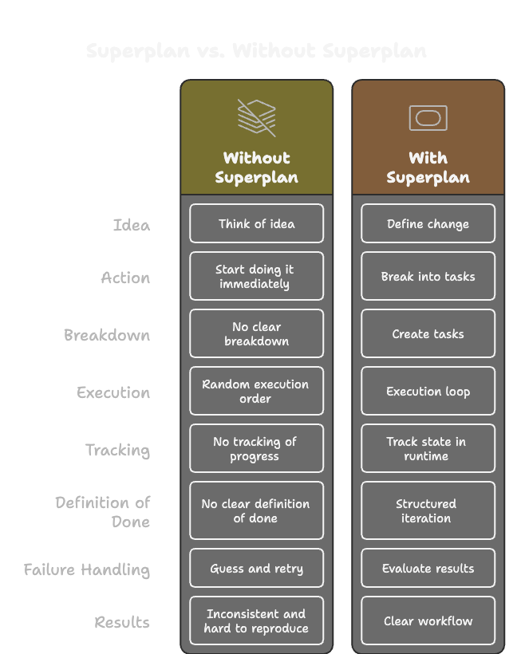

# Superplan CLI

**Agent-first repo planning that actually sticks.**

Superplan turns rough planning into repo-native task contracts, explicit runtime state, and durable context under `.superplan/`. It ensures your coding agent doesn't just jump into code, but steps back to shape the work first.

<br/>



## How it works

It starts from the moment an agent needs structure in a repo. Instead of relying on chat memory, scratch notes, or ad hoc TODOs, it gives the work a local home under `.superplan/`.

Once you or your agent identifies a change, Superplan helps you shape it into a graph of executable tasks. You sign off on the design, and then the agent launches into a **runtime-guided execution loop**. 

Because task contracts, runtime state, and durable context all live locally in the repo, another agent can resume later without guessing what happened last. Your coding agent just has **Superplan**.

## Why Superplan?

Normal planning drifts. Superplan adds runtime truth.

| Normal planning | Superplan planning |
| --- | --- |
| Notes and plans drift across chats | Task contracts live under `.superplan/changes/` |
| The next step is often guessed | `superplan run --json` continues the next task |
| “Done” is often ambiguous | `complete` and `approve` make review explicit |
| Handoffs depend on chat memory | Durable context makes work resumable |

## What's Inside: The Skills Library

Superplan is built on a set of composable **Skills** that guide your agent through the lifecycle:

- 🛡️ **superplan-entry**: The mandatory gatekeeper. Decides if Superplan should engage or stay out.
- 🎨 **superplan-shape**: Turns rough ideas into a validated graph of executable tasks.
- 🏗️ **superplan-execute**: The main runtime loop. Manages task pickup, resumption, and handoffs.
- 🧪 **superplan-review**: Validates implementation against acceptance criteria before signoff.
- 🚑 **superplan-debug**: Systematic troubleshooting when tasks fail or drift.
- 📑 **superplan-docs**: Keeps READMEs and internal context in sync with code changes.

## Quick Start

### 1. Install
```bash
curl -fsSL https://raw.githubusercontent.com/superplan-md/superplan-plugin/alpha.4/scripts/install.sh | SUPERPLAN_REF=alpha.4 sh
```

### 2. Initialize
```bash
superplan init
```

### 3. Track a Change
```bash
superplan change new my-feature --json
# author .superplan/changes/my-feature/tasks.md
superplan validate my-feature --json
superplan task batch my-feature --stdin --json
```

## The Workflow Loop

Stay in the flow with narrow, JSON-first commands:

```bash
superplan status --json  # See what's next
superplan run --json     # Start/continue the next task
```

| Lifecycle | Command |
| --- | --- |
| **Review** | `superplan task complete <id>` |
| **Signoff** | `superplan task approve <id>` |
| **Blocker** | `superplan task block <id> --reason "..."` |
| **Fix** | `superplan task fix --json` |

---

## Core Philosophy

1. **Mandatory First Contact**: Every repo-work request must pass through `superplan-entry`.
2. **CLI as Control Plane**: Once engaged, the CLI is the absolute source of truth for runtime state—never edit lifecycle metadata in task files by hand.
3. **Durable over Ephemeral**: Plans belong in the repo (version-controlled contracts), not in chat memory.
4. **Fastest Path to Init**: If a repo needs Superplan, `init` should be automatic and invisible whenever possible.

For advanced setup, internal specs, and development details, see [docs/CONTRIBUTING.md](docs/CONTRIBUTING.md).

## Credits
Inspired by **Superpowers** and its approach to structured agentic workflows.

## License
Apache License 2.0. See [LICENSE](LICENSE) for details.
